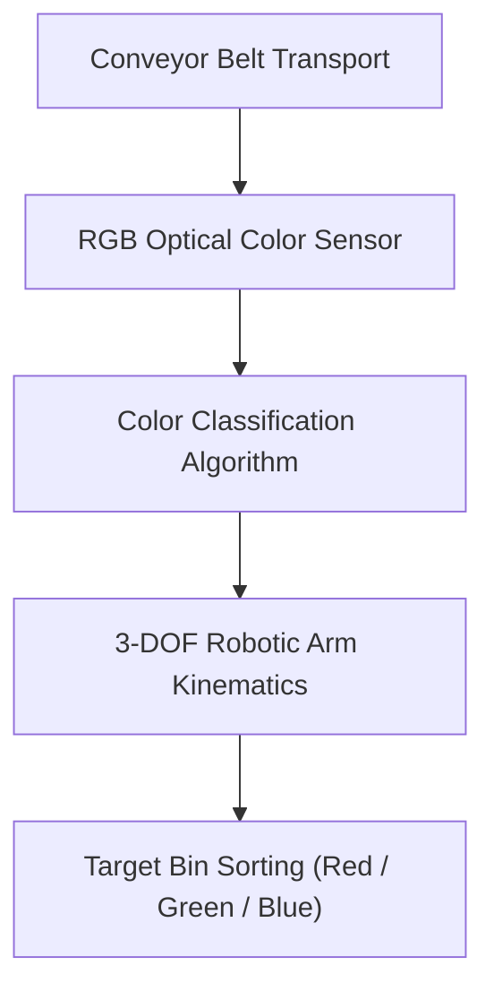

# Automated Color Sorting Conveyor & Robot

---

## 📌 Project Overview

Automated industrial sorting system featuring a conveyor belt, RGB color sensor array, and robotic pick-and-place arm for color-based object classification and bin placement.

This project is an engineering module built by **DJIDEL Abdelali Rayan** (Systems & Automation Engineer, USTHB).

---

## 🏗️ System Architecture & Data Flow

---

## 🛠️ Key Technologies & Frameworks

- **Optoelectronic Sensors**
- **Robotic Arm**
- **Arduino**
- **Industrial Automation**

---

## 🚀 Live Interactive Web Demo

No installation required! Test and interact with the full web simulation live in your browser:
🔗 **[Launch Interactive Web Demo](https://djidelabdelali.github.io/automated-color-sorting-robot/)**

---

## 🔗 Connected Portfolio Ecosystem

- 🌐 **Main Portfolio**: [djidelabdelali.github.io/portfolio](https://djidelabdelali.github.io/portfolio/)
- 💻 **GitHub Profile**: [github.com/DjidelAbdelali](https://github.com/DjidelAbdelali)
- 💼 **LinkedIn Profile**: [DJIDEL Abdelali Rayan](https://linkedin.com/in/djidel-abdelali-rayan-814b25207)

---

  Developed by DJIDEL Abdelali Rayan — Systems & Automation Engineering

